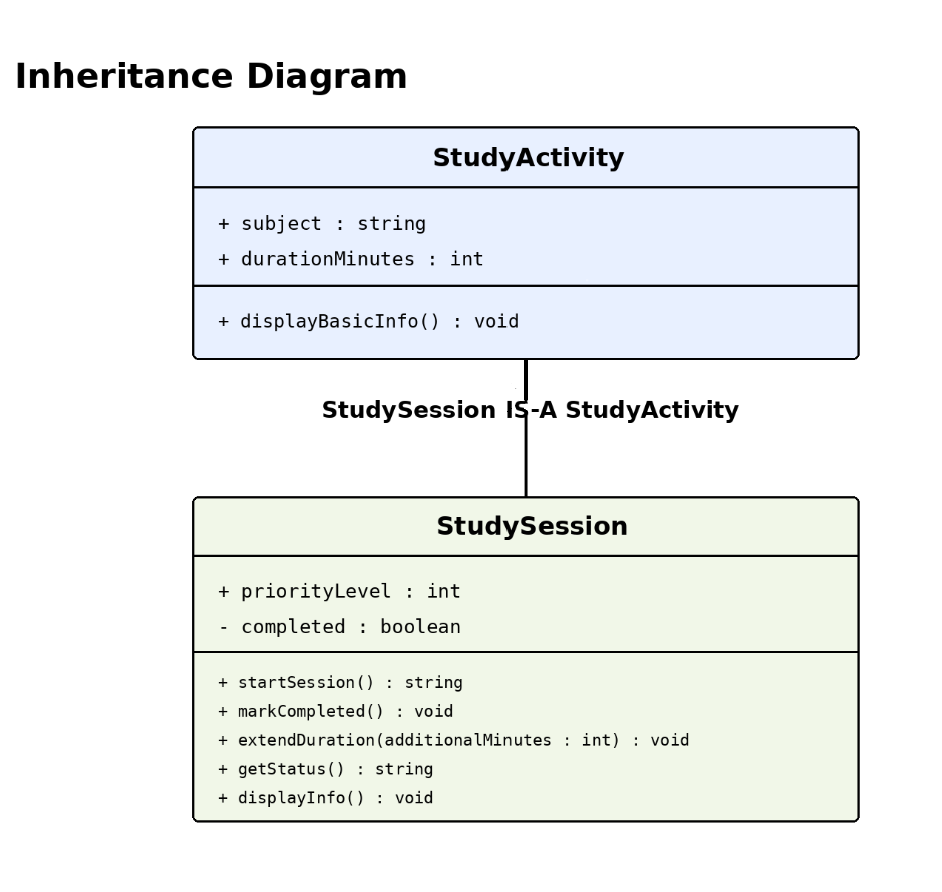
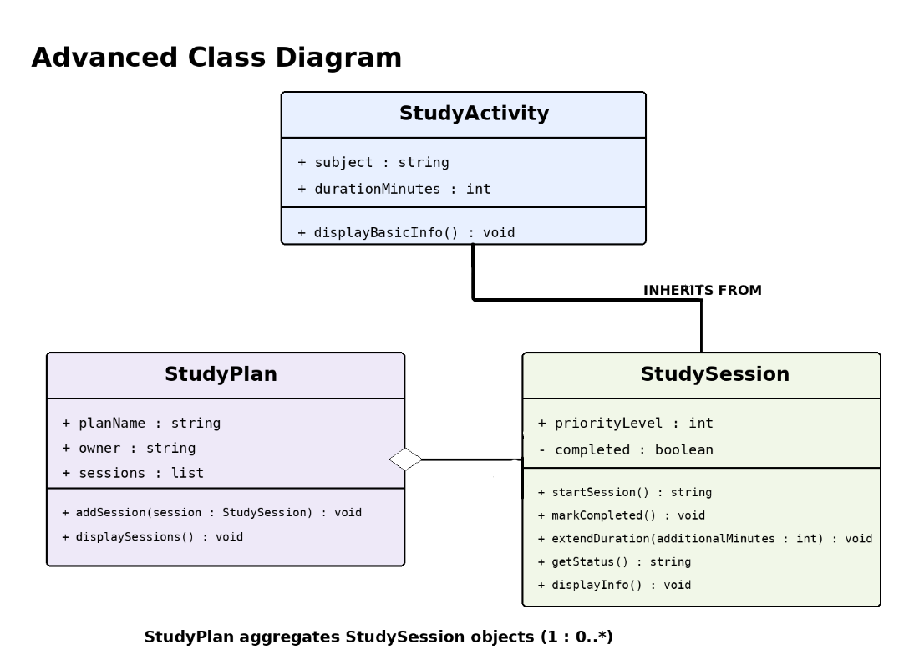
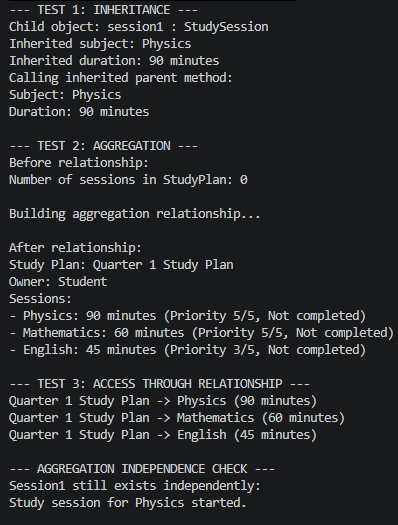
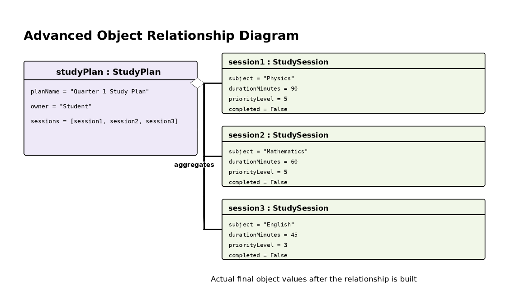

# Advanced Class Relationships

## Previous Activities

[Part I - Class Attributes and Methods](https://github.com/mjpalarcon-max/9siliconcs3/blob/main/q1/My%20OOP%20Seed%20System/classAttributesMethods.md)
[Part II - Class Relationships](https://github.com/mjpalarcon-max/9siliconcs3/blob/main/q1/My%20OOP%20Seed%20System/classRelationships.md)

## Existing System Description:

### 1. What classes currently exist in your system?

**Class 1:** StudySession
**Class 2:** StudyPlan

### 2. What problem or limitation exists in your current design?

The previous design works, but the StudySession class contains both general study-activity information and information specific to a study session. This could lead to repeated code if other types of study activities are added in the future. A better design is to place the common information in a general StudyActivity parent class and let StudySession inherit from it.

## Inheritance Relationship
Parent: StudyActivity
Child: StudySession
Explanation: A StudySession is a type of StudyActivity because every study session has a subject and a planned duration. The StudySession class adds more specific information such as priority level and completion status. Therefore, StudySession is a specialized form of StudyActivity.

## Inheritance UML

## Composition/Aggregation
Relationship:
Explanation:

## Advanced UML Diagram

## Python Implementation
[Source Code](advancedRelationships.py)

## Test Run

## Object Diagram

## Reflection
Answers:
