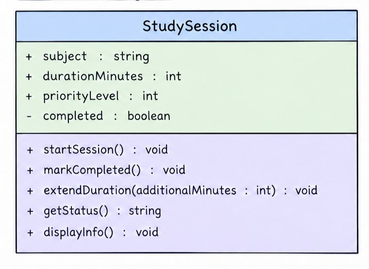

## Previous Design
Link to my previous activity:
[classObjectUML.md](https://github.com/mjpalarcon-max/9siliconcs3/blob/main/q1/My%20OOP%20Seed%20System/classObjectUML.md)

## Design Revision
* I kept the same `StudySession` class and personal productivity context.
* I changed the `completed` attribute to **private** so its value is protected from direct modification.
* I kept the original `startSession()`, `markCompleted()`, and `extendDuration()` methods.
* I added `getStatus()` so the program can safely read the private `completed` attribute.

## Visibility Decisions

| Attribute         | Data Type | Visibility | Why Public/Private?                                                                                |
| ----------------- | --------- | ---------- | -------------------------------------------------------------------------------------------------- |
| `subject`         | string    | Public     | Other parts of the program should be able to access the subject of the study session.              |
| `durationMinutes` | int       | Public     | The planned study duration should be accessible and adjustable by the program.                     |
| `priorityLevel`   | int       | Public     | Other parts of the program may need to know the importance of the session.                         |
| `completed`       | boolean   | Private    | The completion state should be controlled through class methods instead of being changed directly. |

## Updated UML Class Diagram
