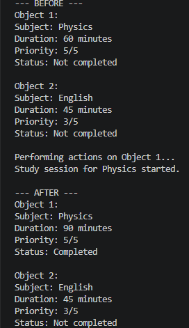
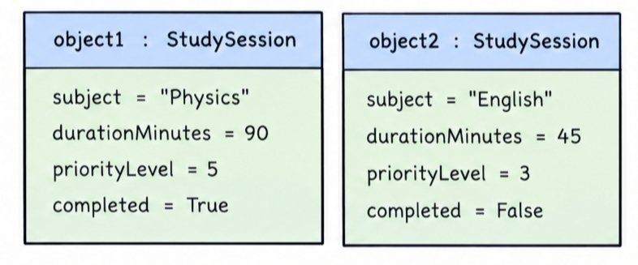

## Previous Design
Link to my previous activity:
[classObjectUML.md](https://github.com/mjpalarcon-max/9siliconcs3/blob/main/q1/My%20OOP%20Seed%20System/classObjectUML.md)

## Design Revision
* I kept the same "StudySession" class and personal productivity context.
* I changed the "completed" attribute to **private** so its value is protected from direct modification.
* I kept the original "startSession()", "markCompleted()", and "extendDuration()" methods.
* I added "getStatus()" so the program can safely read the private "completed" attribute.

## Visibility Decisions

| Attribute         | Data Type | Visibility | Why Public/Private?                                                                                |
| ----------------- | --------- | ---------- | -------------------------------------------------------------------------------------------------- |
| `subject`         | string    | Public     | Other parts of the program should be able to access the subject of the study session.              |
| `durationMinutes` | int       | Public     | The planned study duration should be accessible and adjustable by the program.                     |
| `priorityLevel`   | int       | Public     | Other parts of the program may need to know the importance of the session.                         |
| `completed`       | boolean   | Private    | The completion state should be controlled through class methods instead of being changed directly. |

## Updated UML Class Diagram

## Python Implementation 
[View Python Source](https://github.com/mjpalarcon-max/9siliconcs3/blob/main/q1/My%20OOP%20Seed%20System/classImplementation.py)

## Test Run

## Object Diagram

## Analysis

### 1. Why did you make your chosen attribute private?
 
I made "completed" private because the completion status should be controlled by the "StudySession" class rather than changed directly by other parts of the program. Directly changing it could cause a session to be incorrectly marked as completed or not completed. The "markCompleted()" method provides a controlled way to change the value. The "getStatus()" method allows the program to read the private value safely.
 
### 2. Which method changes the state of your object?
 
The "extendDuration(additionalMinutes)" method changes the "durationMinutes" attribute by adding the specified number of minutes to the current duration. The "markCompleted()" method also changes the object's state by changing the private "completed" value to "True". In the test run, Object 1's duration changed from 60 to 90 minutes and its status changed from Not completed to Completed. Object 2 was not modified.
 
### 3. How did your two objects demonstrate that instances are independent?
 
The two objects were created from the same "StudySession" class but were given different values. Object 1 represented a Physics session of 60 minutes, while Object 2 represented an English session of 45 minutes. After methods were executed only on Object 1, its duration and completion status changed while Object 2 remained at 45 minutes and Not completed. This proves that each object maintains its own independent state.
 
### 4. What is the difference between your class diagram and your object diagram?
 
The class diagram represents the blueprint of the "StudySession" class and shows its attributes, data types, visibility, and methods. The object diagram represents actual objects created from that class and shows the values stored in those objects. In this activity, Object 1 contains Physics, 90 minutes, priority 5, and Completed, while Object 2 contains English, 45 minutes, priority 3, and Not completed. Therefore, the class diagram describes the structure of objects, while the object diagram shows the actual state of specific instances.

