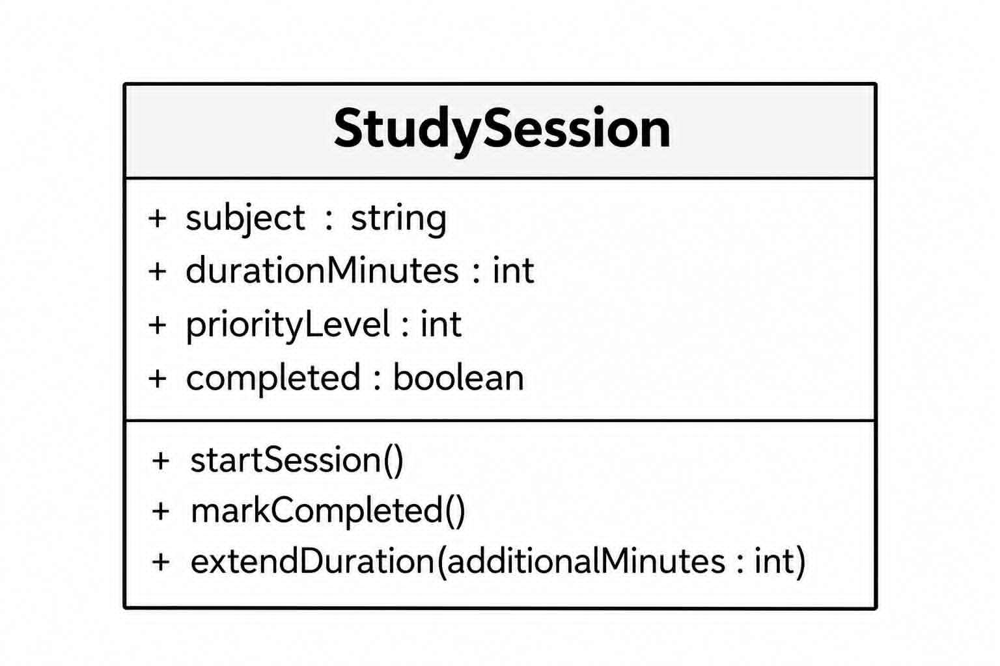

# SG4 - Understanding Classes and Objects
## Class Name: StudySession
## Class Description

The `StudySession` class represents a scheduled study session that a student can use to organize and track their studying. It stores important information about the session and provides actions for managing its progress.

## Properties

| Property        | Data Type | Description                                            |
| --------------- | --------- | ------------------------------------------------------ |
| subject         | string    | The subject that the student will study                |
| durationMinutes | int       | The planned length of the study session in minutes     |
| priorityLevel   | int       | The importance of the study session, from 1 to 5       |
| completed       | boolean   | Indicates whether the study session has been completed |

## Methods

| Method                                 | Description                                       |
| -------------------------------------- | ------------------------------------------------- |
| startSession()                         | Starts the study session and marks it as active.  |
| markCompleted()                        | Marks the study session as completed.             |
| extendDuration(additionalMinutes: int) | Adds extra minutes to the planned study duration. |

## Design Explanation

### Why did you choose this class?

I chose the `StudySession` class because studying is an important part of a student's daily routine. This class can help organize study time and keep track of whether a planned session has been completed.

### Which property is the most important? Why?

The most important property is `durationMinutes` because it determines how long the student plans to study. It helps the student manage their available time and stay focused during the session.

### Which method is the most useful? Why?

The most useful method is `markCompleted()` because it allows the system to keep track of finished study sessions. This makes it easier for the student to monitor their progress.