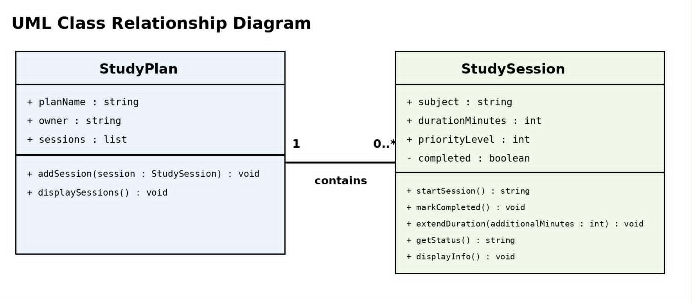
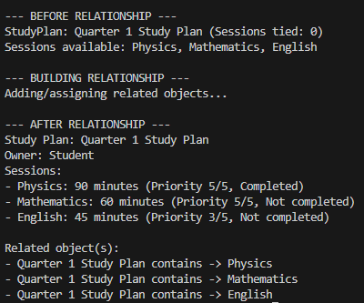
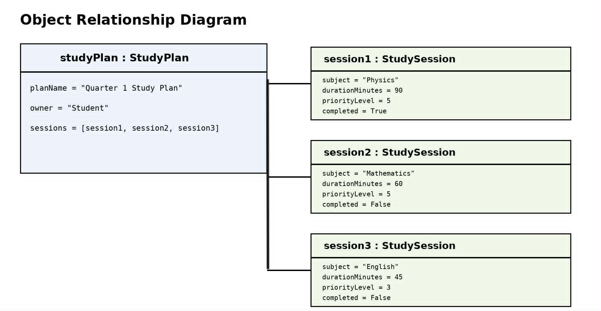

# Class Relationships: Association and Multiplicity
## Previous Work

[Part I - Classes and Objects](https://github.com/mjpalarcon-max/9siliconcs3/blob/main/q1/My%20OOP%20Seed%20System/classObjectUML.md)
[Part II - Class Attributes and Methods](https://github.com/mjpalarcon-max/9siliconcs3/blob/main/q1/My%20OOP%20Seed%20System/classAttributesMethods.md)

## Existing Class
Class: StudySession

Description: The StudySession class represents a scheduled study session that a student can use to organize and track studying.

## New Related Class
Class: StudyPlan

Description: The StudyPlan class represents a student’s overall study plan. It stores the name and owner of the plan and keeps a list of StudySession objects belonging to the plan.

## Association
Relationship: StudyPlan contains StudySession objects

Explanation: This is a HAS-A relationship because a StudyPlan has study sessions as part of its schedule. The StudyPlan stores references to actual StudySession objects.

## Multiplicity
Multiplicity: 1 : 0..*

Explanation: One StudyPlan can contain zero or more StudySession objects. A plan may initially have no sessions, but it can contain many sessions as the student adds subjects and study activities.

## UML Class Relationship Diagram

## Python Implementation
[View Python Source](classRelationships.py)

## Test Run

## Object Relationship Diagram

## Analysis

### What is the association between your two classes?
The association in my system is that a StudyPlan contains StudySession objects. The StudyPlan organizes several individual sessions into one overall study schedule. Each StudySession remains its own object, but the study plan keeps references to those objects.

### What multiplicity did you choose, and why?
I chose a 1 : 0..* multiplicity. One StudyPlan can contain zero or more StudySession objects because a plan may initially have no sessions and can later contain many sessions. This is appropriate because a student may organize several study sessions under one study plan.

### How did you implement the relationship in Python?
I implemented the relationship using the sessions attribute of the StudyPlan class. This attribute is a list, and the addSession() method adds actual StudySession objects to that list. For example, studyPlan.addSession(session1) stores the session1 object itself.

### Why did you store an object reference instead of copying its data?
I stored object references so the study plan can work with the actual StudySession objects. For example, displaySessions() can access session.subject, session.durationMinutes, and session.getStatus() directly from each related object. This avoids creating duplicate copies of the same session information.

### If your relationship uses “many,” why is a list appropriate?
A list is appropriate because one study plan can contain multiple study sessions. The sessions list contains the actual StudySession objects session1, session2, and session3. A loop can then process each related object and display its information.
